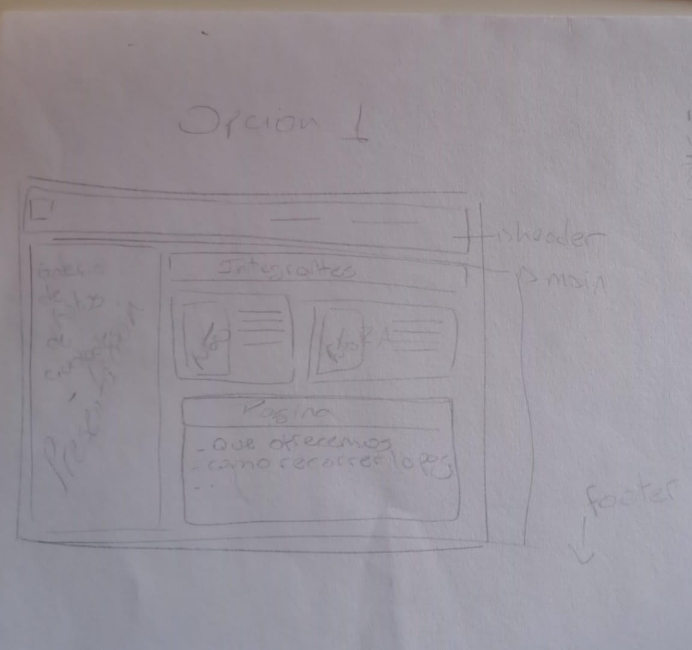
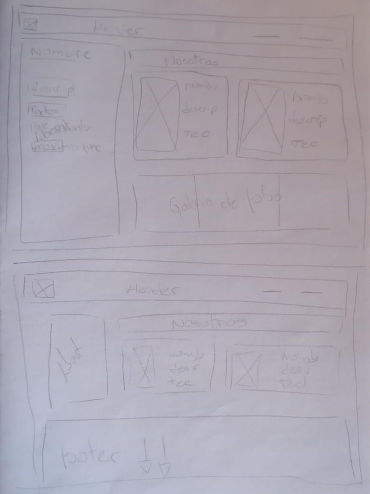
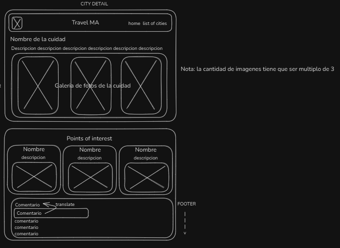
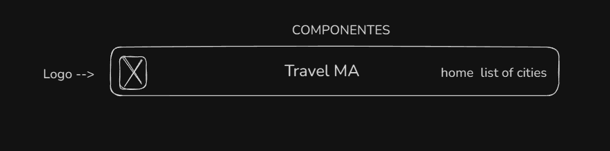
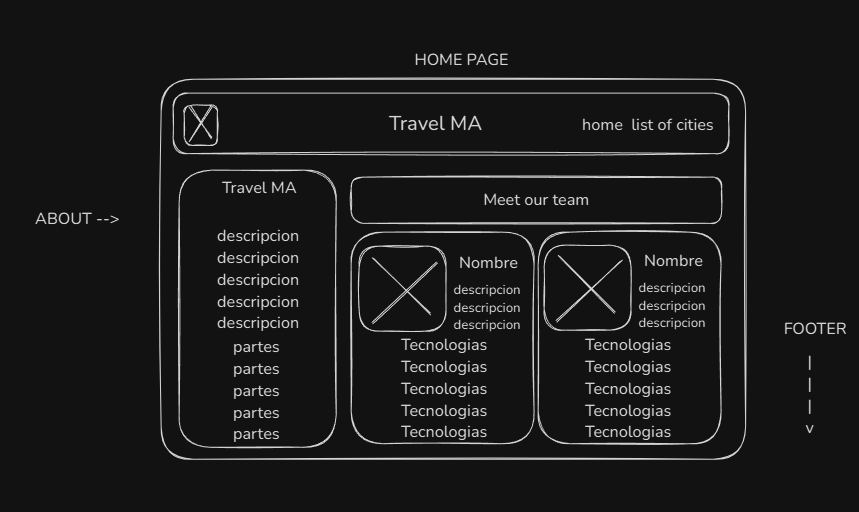
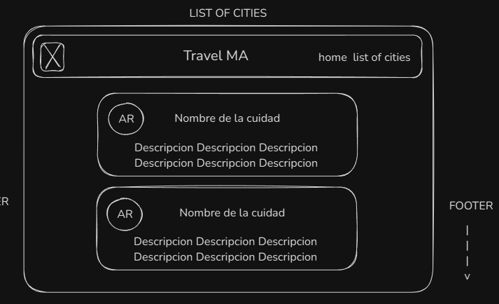
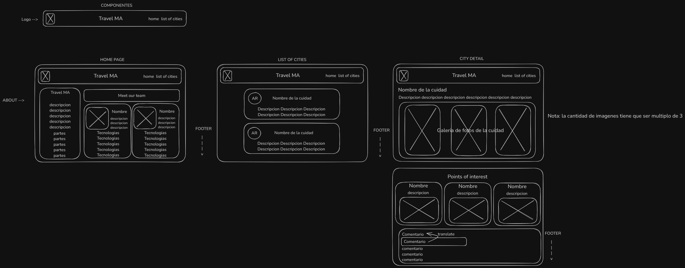

## Descripción del proyecto 🌍

Este proyecto es una aplicación web que permite a los usuarios explorar distintas ciudades turísticas de muchos países del mundo. La aplicación ofrece una experiencia interactiva permitiendo la búsqueda de ciudades, ver detalles de su descripción y puntos de interés para visitar. También permite añadir comentarios sobre cada lugar visitado. Como parte del proyecto, se creó un archivo JSON que contiene los datos de las ciudades. Este archivo se utiliza para alimentar la aplicación con la información necesaria sobre cada ciudad.

## Tecnologías utilizadas 🚀

- **React**: Biblioteca de JavaScript para construir interfaces de usuario.
- **Vite**: Herramienta de construcción y empaquetado rápida para proyectos de React.
- **Tailwind CSS**: Framework de CSS para estilizar la aplicación.
- **React Router**: Biblioteca para la navegación entre páginas.
- **Framer Motion**: Librería para animaciones en React.
- **CSS Vanilla**: Estilos personalizados aplicados en combinación con Tailwind CSS.

## Diagramas y wireframes 📊















## Paleta de colores y fuentes 🎨

```css
--font-color: #282121;
--background-color: #ebd5b8;

--palete-1-1: #332a1a;
--palete-1-2: #7c5b41;
--palete-1-3: #efdcd3;
--palete-1-4: #aa574b;
--palete-1-5: #541c13;
--palete-1-6: #eae5d9;

--palete-2-1: #ebd5b8;
--palete-2-2: #efbc9c;
--palete-2-3: #ea572a;
--palete-2-4: #0b4030;
--palete-2-5: #e39828;
```

## Inspiracion de paginas anteriores con el estilo 🌐

- [Expedia](https://www.expedia.com/)
- [Lonely-Planet](https://www.lonelyplanet.com/)

## Deploy y link

La aplicación está desplegada y disponible en el siguiente enlace:

[Ver Aplicación en Vivo](https://)

## Posibles cambios en el futuro del proyecto 🔮

- **Migración a TypeScript**: Considerar el uso de TypeScript para una mayor seguridad de tipo.
- **Conexión con API**: Integrar una API para obtener datos en tiempo real sobre ciudades y puntos de interés.
- **Soporte Multilenguaje**: Agregar soporte para múltiples idiomas.
- **Mejoras en la Experiencia de Usuario**: Implementar nuevas funcionalidades basadas en el feedback de los usuarios.
- **Integración de mapas interactivos**: Utilizando una API como Google Maps o Leaflet.
- **Optimización para SEO**: Mejorar la visibilidad en motores de búsqueda.

## Integrantes 👥

Matias Martearena: El host

Araceli Escudero: Saliendo un poco de python

